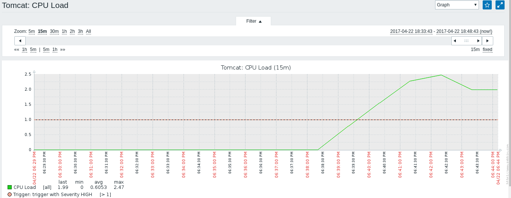
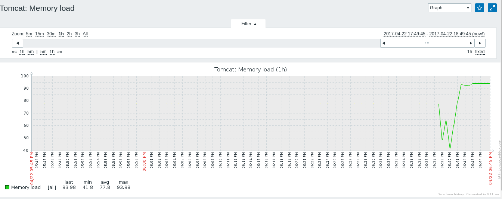
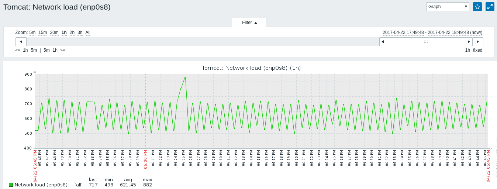
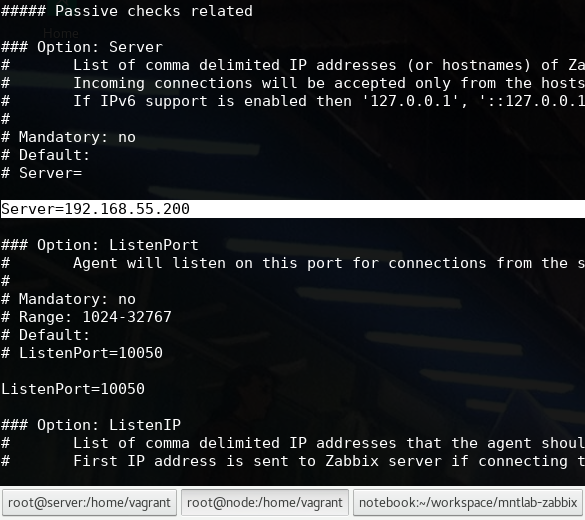
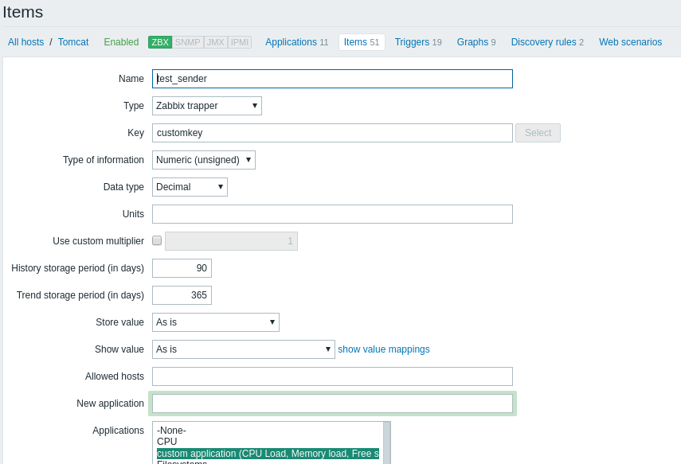
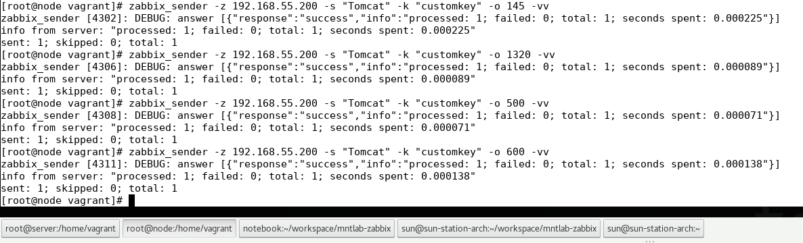
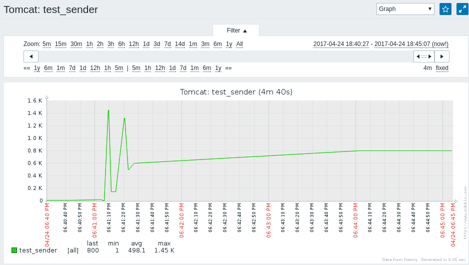
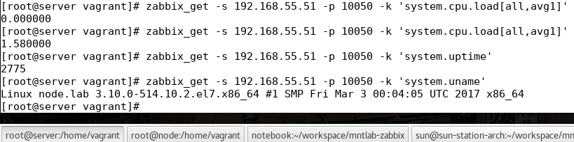

# mntlab-zabbix

# Task 1: Basics

Testing Infrastructure:
Vagrantfile to spin up 2 VMs (virtualbox): zabbix server, provisioned by Vagrant provisioner
Zabbix agents on both VMs, provisioned by Vagrant provisioner

I. You should install and configure Zabbix server and agents.

1. Create User group “Project Owners”
2. Create User (example “FirstName LastName”), assign user to “Project Owners”, set email

- created user 'acherlyonok'

- added user 'acherlyonok' to group 'Project Owners'

3. Add 2nd VM to zabbix: create Host group (“Project Hosts”), create Host in this group, enable ZABBIX Agent monitoring

- created host 'Tomcat' and enabled ZABBIX Agent monitoring

- created group 'Project Hosts' and added 'Tomcat' to it

4. Assign to this host template of Linux 

- linked 'Template OS Linux' to 'Tomcat'

5. Create custom checks (CPU Load, Memory load, Free space on file systems, Network load)

- created apllication 'custom application (CPU Load, Memory load, Free space on file systems, Network load)'

- created custom checks (items)

- CPU Load

- Memory load

- Free space

- Network load

6. Create trigger with Severity HIGH, check if it works (Problem/Recovery)

- created custom trigger

7. Create Action to inform “Project Owners” if HIGH triggers happen

- created custom action

- email configuration

8. Test

- expecting issue

- view excisting issues

- got email notificaion

- notification about problem

- notification that everything is OK

8. *Super Task*: Configure zabbix to work on the server directly without `/zabbix` `http://zabbix-server/zabbix` -> `http://zabbix-server`

II. “Network discovery” configuration using Zabbix UI:

1. Configure “Network discovery” so that, 2nd VM will be joined to Zabbix (group “Project Hosts”, Template “Template OS Linux”)

- created new discovery rule

- created action with included discovery rule as a condition

- added register operation and link to the template

- action summary

- check new host

- ensure host was added to 'Project hosts'

- ensure template was assigned to the founded host

- status

# Task 2: Tools

Testing Infrastructure:
Vagrantfile to spin up 2 VMs (virtualbox): zabbix server, provisioned by Vagrant provisioner
Linux VM with zabbix agent, script for registration on zabbix server, all provisioned by Vagrant provisioner

II. Working with `zabbix_sender` and `zabbix_get`:

1. Configure the agent for replying to the specific server in passive and active mode.

`cat /etc/zabbix/zabbix_agentd.conf`
- *active mode*

- *passive mode*

2. Use zabbix_sender to send data to server manually (use zabbix_sender with key –vv for maximal verbosity).

#### DESCRIPTION
`zabbix_sender` is a command line utility for sending monitoring data to Zabbix server or proxy. On the Zabbix server an item of type *Zabbix trapper* should be created with corresponding key. Note that incoming values will only be accepted from hosts specified in Allowed hosts field for this item.  

- created new item 'test_sender' with key 'customkey'

- pushed data to the server via `zabbix_sender`

- view item 'customkey' on graph

3. Use zabbix_get as data receiver and examine zabbix agent sending’s.

- view items via `zabbix_get`

