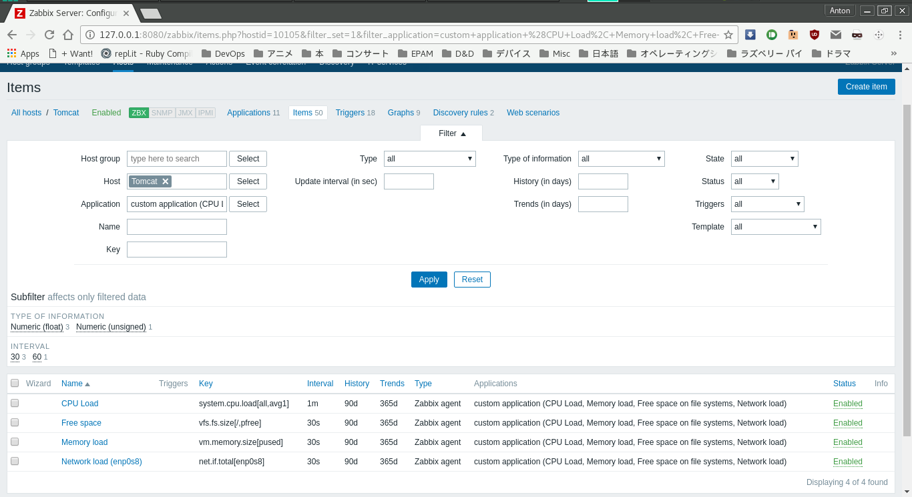

# mntlab-zabbix

# Task 1: Basics

Testing Infrastructure:
Vagrantfile to spin up 2 VMs (virtualbox): zabbix server, provisioned by Vagrant provisioner
Zabbix agents on both VMs, provisioned by Vagrant provisioner

I. You should install and configure Zabbix server and agents.

1. Create User group “Project Owners”
2. Create User (example “FirstName LastName”), assign user to “Project Owners”, set email

- created user 'acherlyonok'

- added user 'acherlyonok' to group 'Project Owners'

3. Add 2nd VM to zabbix: create Host group (“Project Hosts”), create Host in this group, enable ZABBIX Agent monitoring

- created host 'Tomcat' and enabled ZABBIX Agent monitoring

- created group 'Project Hosts' and added 'Tomcat' to it

4. Assign to this host template of Linux 

- linked 'Template OS Linux' to 'Tomcat'

5. Create custom checks (CPU Load, Memory load, Free space on file systems, Network load)

- created apllication 'custom application (CPU Load, Memory load, Free space on file systems, Network load)'

- created custom checks (items)

6. Create trigger with Severity HIGH, check if it works (Problem/Recovery)

- created custom trigger

7. Create Action to inform “Project Owners” if HIGH triggers happen

- created custom action

- email configuration

8. Test

- expecting issue

- email configuration

- email configuration

- email configuration

- email configuration

8. *Super Task*: Configure zabbix to work on the server directly without /zabbix 
http://zabbix-server/zabbix -> http://zabbix-server

II. Using Zabbix UI:
1. Configure “Network discovery” so that, 2nd VM will be joined to Zabbix (group “Project Hosts”, Template “Template OS Linux”)

# Task 2: Tools

Testing Infrastructure:
Vagrantfile to spin up 2 VMs (virtualbox): zabbix server, provisioned by Vagrant provisioner
Linux VM with zabbix agent, script for registration on zabbix server, all provisioned by Vagrant provisioner

1. Configure the agent for replying to the specific server in passive and active mode.

2. Use zabbix_sender to send data to server manually (use zabbix_sender with key –vv for maximal verbosity).

3. Use zabbix_get as data receiver and examine zabbix agent sending’s. 
